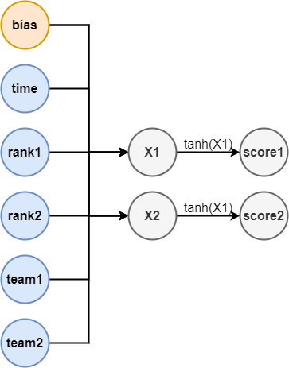

# Introduction
- In this project, I use the data from the FIFA Ranking (Europe) and the result from the EURO 2020 group stage to build the scores prediction model.
- The input of this model is the time start (GMT+7), the name of 2 team.
- To see how I analyse the data, please look at the **Untitle.ipynb** file.
# About the model
- After having input of the 2 teams and the start time, we will get the rank and the point of both teams according to the file **data.csv**.
- We have 5 numerical inputs in total:
    - **time**: the time the game begins.
    - **rank1**: rank of the team 1
    - **rank2**: rank of the team 2
    - **point1**: point of the team 1
    - **point2**: point of the team 2
- We build a neuron-network, its shape is described as below: 
 
# Deploy the model
- The model gave been deployed on https://euro-2020-scores-prediction.herokuapp.com/, please feel free to enjoy.